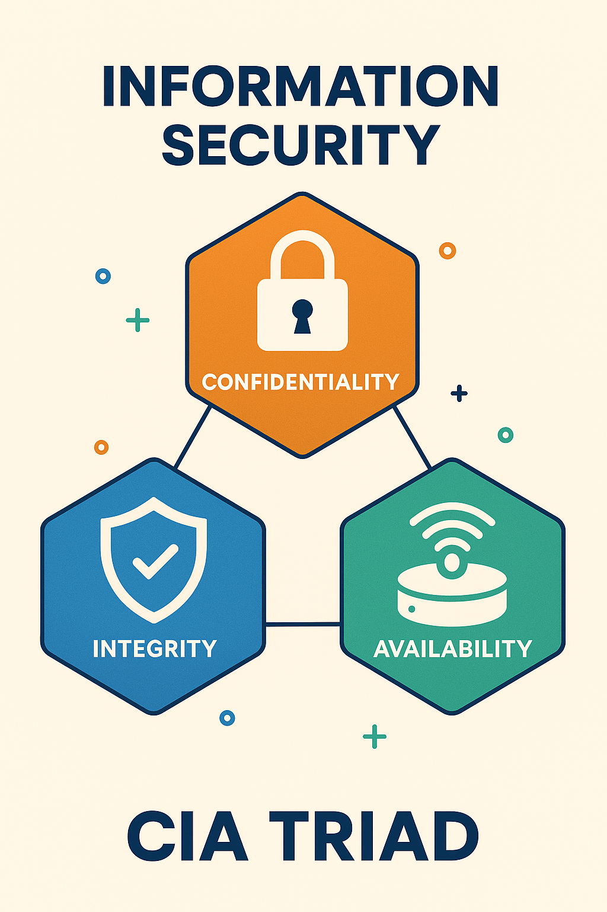

# Information Security (InfoSec)

**What is information security?**
Infosec is an umbrella term that encompasses the processes and components used to ensure information is kept secure, especially information that contains **personally identifiable information (PII)**

It involves the prevention and reduction of the likelihood of unauthorised access to, use of, manipulation of, and destruction of information. It also minimises the unautorised disclosure and disruption to access information.

The main purpose is to ensure the **confidentiality, integrity, and availability** of information. Also known as the **CIA triad** which is a core principle for bothj security and cybersecurity.

## 1. Confidentiality
- Involves the efforts of an organisation to ensure data is kept secret and or private.
- Access to information must be controlled to prevent the unauthorised sharing of data - whether intentional or accidental.
- One key component is to make sure that people without proper authorisation are prevented from accessing assets important to your organisation.
- Conversely, those who need to have access should only have the necessary least-privileges to perform their roles e.g those in Finance should only have access to information and tools related to the flow of money.

### How confidentiality can be compromised
- Direct attacks aimed at gaining access to systems the attacker does not have the rights to see.
- Attackers use techniques like [Man-in-the-Middle Attack](https://www.fortinet.com/uk/resources/cyberglossary/man-in-the-middle-attack), where the attacker position themselves in the stream of information to intercept data and then either steal alter it.
- Attackers can also spy on organisations' network to gain access to credentials. In some cases, they will try and gain more system privileges to obtain next level of clearance.
- Human errors or insufficient security controls also play a part to confidentiality getting compromised. A recent example was the [McDonald's AI Hiring Bot incident](https://www.wired.com/story/mcdonalds-ai-hiring-chat-bot-paradoxai/) where applicants data (around 64 million records) were compromised. These included applicants' names, email addresses, and phone numbers. Even though it was not by bad attackers, but it shows how insufficient security controls like the administrator account's username and password being "123456" can easily compromise all that amount of data.

### How to prevent confidentiality breaches
Organisations should:
- Classify and label restricted data
- Enable access control policies across the organisation
- Encrypt data
- Use multi-facto-authentication (MFA)
- Conduct training and knowledge share across the wider organisation to educate the everyone on the dangers and how to avoid them.

## 2. Integrity
- Integrity is all about making sure your data is trustworthy and free from tampering. Integrity of the data is maintained onyl if the data is authentic, accurate and reliable.
- It is important to ensure that data is not altered or deleted by unauthorised users.

### How integrity can be compromised
- Attackers can compromise integrity by altering data in transit or at rest. This can be done by bypassing an [intrusion detection system (IDS)](https://www.fortinet.com/uk/resources/cyberglossary/intrusion-detection-system), changing file configurations to allow unauthorised acces, or alter the logs to hide the attack.
- Can also be compromised by accident when someone accidentally enters the wrong code or if the security policies, protections and procedures are inadequate.

### How to prevent integrity breaches
Organisations should:
- Implement access control policies to ensure only authorised users can modify data.
- Use hashing, encryption, digital certificates, or digital signatures to protect the data.

## 3. Availability
- Data is often useless unless it is available to those that need to access them, even if it's kept confidential and it's integrity maintained.
- Systems, networks and applications must be functioning as they should and when they should.
- Individuals with access to specific information must be able to consume it when they need to.

### How availability can be compromised
- Attackers can compromise availability by launching a [Denial of Service (DoS)](https://www.fortinet.com/uk/resources/cyberglossary/dos-vs-ddos) attack or ransomware.
- Organisations not having a proper [disaster recovery](https://www.fortinet.com/uk/resources/cyberglossary/disaster-recovery) plan in place. When unforeseen or natural events occur e.g power outage, sever storm, flood, availability can be compromised because user are not able to gain access to critical systems.

### How to prevent availability breaches
Organisations should:
- Implement redundancy and failover systems to ensure that critical systems are always available.
- IT teams to stay on top of upgrading of software and security systems.
- Ensure backups and disaster recovery plans are in place to help them regain availability soon after an event.

## Summary
Information security isn’t just a technical checkbox — it’s the backbone of trust in the digital age. By understanding the CIA triad — Confidentiality, Integrity, and Availability — organisations can build resilient systems that protect sensitive data, maintain its accuracy, and ensure it’s accessible when needed. From thwarting man-in-the-middle attacks to preparing for natural disasters, the key lies in proactive strategy, smart controls, and continuous education.

As we move forward, we’ll dive deeper into real-world attack scenarios, explore modern security frameworks, and share practical tips for building a security-first culture. Stay tuned — your journey into InfoSec mastery is just getting started.

Link to blog [Information Security]()